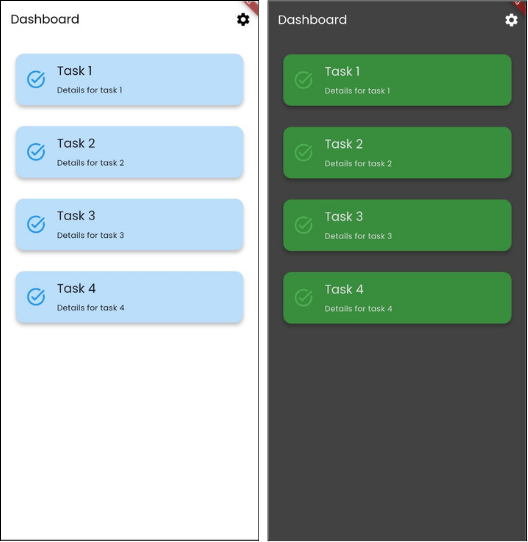
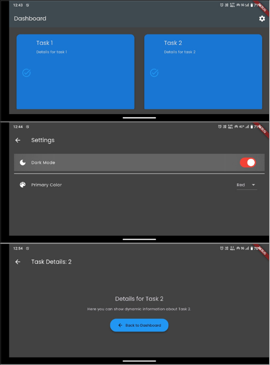
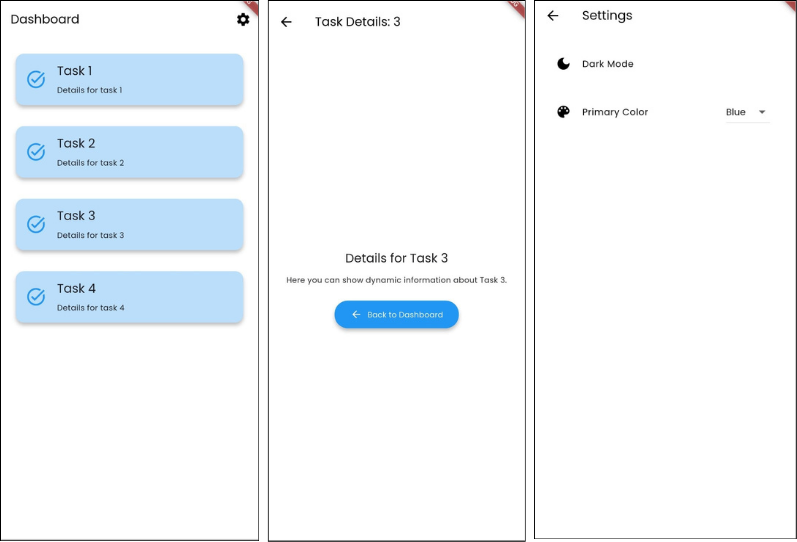
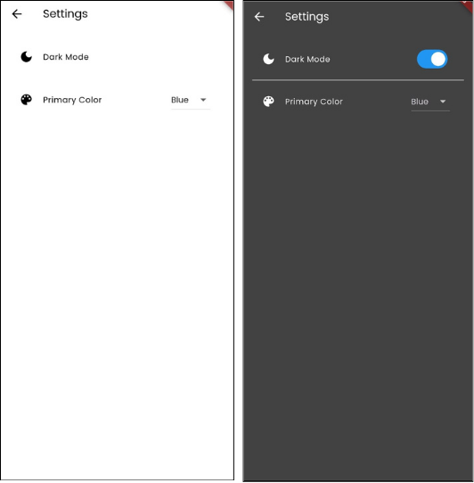
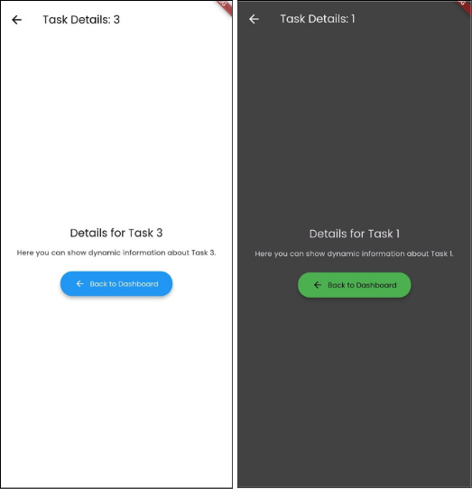

# FlexDash Productivity App

A Flutter prototype demonstrating responsive design, multi-screen navigation, and dynamic theming.

## Features

- **Responsive Layouts**

  - Portrait: single-column vertical list
  - Landscape (small width): horizontal scrolling row
  - Landscape (medium width): 2-column grid
  - Landscape (large width): 4-column grid
  - Layout adapts using `MediaQuery` (for orientation) and `LayoutBuilder` (for width constraints)

- **Multi-Screen Navigation**

  - Named routes (defined in `screen_ids.dart`):
    - `/` → Home Dashboard
    - `/details` → Detail Screen (tapped task details)
    - `/settings` → Settings Screen
  - Dashboard cards are tappable; on tap, the selected task’s index is passed as `arguments` to the Detail Screen.
  - Built-in back navigation via AppBar back arrow.

- **Dynamic Theming & Styling**
  - Global theme defined in `main.dart` using `ThemeData` + Google Fonts (Poppins)
  - Toggle Light / Dark mode in Settings
  - Choose primary color (Blue, Green, Red) in Settings; updates AppBar, buttons, cards, and icons
  - Consistent widget styling:
    - Rounded, elevated buttons
    - Cards with shadows, adaptive background tint from the current primary swatch
    - Icons on all actionable items for clarity

## Installation & Running

1. **Prerequisites**

   - Flutter SDK ≥ 3.0.0
   - Dart SDK (bundled with Flutter)

2. **Run on Device or Simulator**

   ```bash
   flutter run
   ```

3. **Testing on Different Orientations**

   - Rotate your device or emulator to see the dashboard switch between list, row, and grid layouts.
   - On wide screens (tablets/desktops), observe the number of columns increase.

## Project Structure

```bash
flexdash/
├─ lib/
│ ├─ main.dart # App entry point + theme state management
│ ├─ screen_ids.dart # Centralized route names
│ └─ screens/
│ ├─ home_screen.dart # Dashboard with responsive LayoutBuilder
│ ├─ detail_screen.dart # Shows details for tapped task index
│ └─ settings_screen.dart # Dark mode switch & primary-color dropdown
├─ pubspec.yaml # Dependencies + Google Fonts + uses-material-design
└─ README.md # This file
```

## Adaptive Layout Design

- **MediaQuery**: Detects `Orientation.portrait` vs. `Orientation.landscape`.
- **LayoutBuilder**: Reads `constraints.maxWidth` to choose:

  - **Portrait**: single-column `ListView`
  - **Landscape, width < 800px**: horizontal `Row` scroll
  - **Landscape, 800–1200px**: 2-column `GridView`
  - **Landscape, >1200px**: 4-column `GridView`

## Navigation

- **Named Routes** (in `screen_ids.dart`):

  - `/` → `HomeScreen`
  - `/details` → `DetailScreen` (receives tapped task index)
  - `/settings` → `SettingsScreen`

- **Passing Arguments**:

  ```dart
  Navigator.pushNamed(
  context,
  ScreenIds.details,
  arguments: index,
  );
  ```

- **Retrieving Arguments** in `DetailScreen`:

  ```dart
  final index = ModalRoute.of(context)!.settings.arguments as int?;
  ```

  Back navigation is provided automatically by the AppBar’s back arrow.

## Styling & Theming

- **Global Theme** (`main.dart`):

  - `primarySwatch` and `brightness` stored in a `StatefulWidget`
  - Google Fonts (Poppins) via `GoogleFonts.poppinsTextTheme()`
  - `ElevatedButtonTheme` and `CardTheme` with rounded corners, shadows, and consistent padding

- **Settings Screen Controls**:

  - **Dark Mode** toggle (`SwitchListTile` with `Icons.dark_mode`)
  - **Primary Color** dropdown (`DropdownButton<MaterialColor>` with `Icons.color_lens`)

Switching these options updates the app’s theme in real time, affecting AppBar, buttons, cards, and icons.

# Submission Checklist

1. **Flutter Project Files**

   - entire `lib/` folder, plus `pubspec.yaml` and `README.md`.

2. **Screenshots**  
   _screenshots in the `images/` folder and are referenced below:_

   - **Dashboard in Portrait Mode**  
     
   - **Dashboard in Landscape Mode**  
     
   - **Navigation: Home → Details → Settings**  
     
   - **Styled Widgets & Themes & Details**  
     
     

3. **README File**
   - Instructions to build and run the app
   - Brief explanation of the adaptive layout design, navigation, and styling
